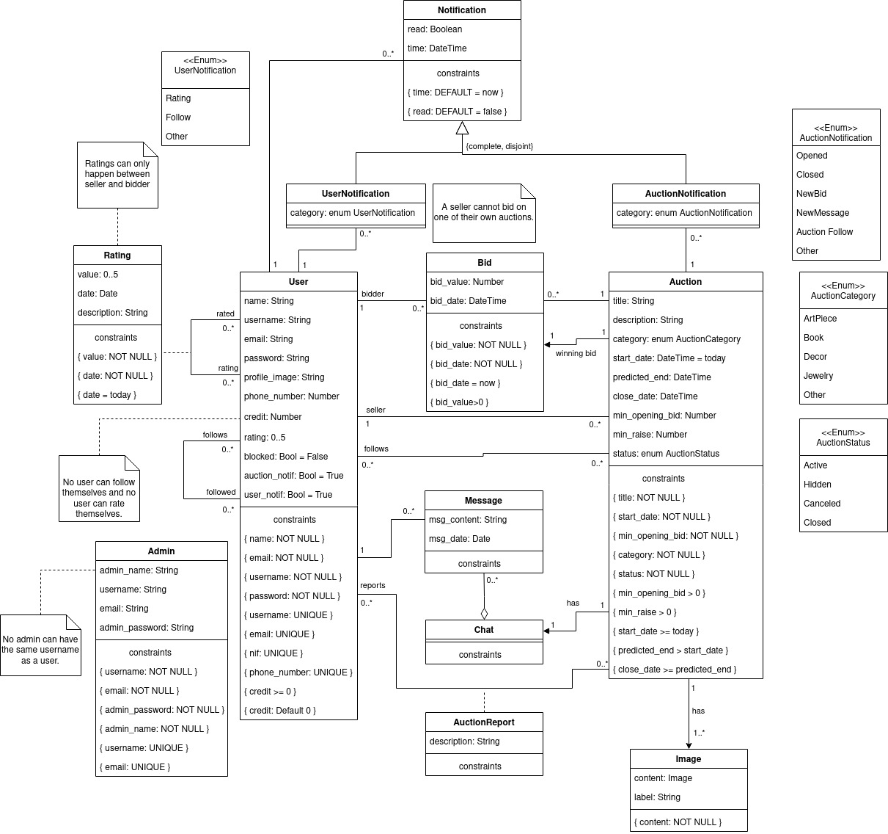

# EBD: Database Specification Component

The project Hand of Midas is an online auction system available over the Web for users to buy and sell a variety of items .

## A4: Conceptual Data Model

The Conceptual Domain Model contains the identification and description of the entities of the domain and the relationships between them in an UML class diagram.

### 1. Class diagram

UML class diagram containing the classes, associations, multiplicity and roles.  
 For each class, the attributes, associations and constraints are included in the class diagram.

### 2. Additional Business Rules
 
| Business rules | Description |
| :---           |  :---       |
| BR01           | A user cannot put an item for auction if he cannot prove the ownership of said item.|
 

---

## A5: Relational Schema, validation and schema refinement

This artifact contains the Relational Schema obtained by mapping from the Conceptual Data Model.

### 1. Relational Schema

The Relational Schema includes the relation schemas, attributes, domains, primary keys, foreign keys and other integrity rules: UNIQUE, DEFAULT, NOT NULL, CHECK.  
Relation schemas are specified in the compact notation:  

| Relation reference | Relation Compact Notation                        |
| ------------------ | ------------------------------------------------ |
| R01                | user(__user_id__, email UK NN, name NN, username NN UK, password NN, image, nif UK, phone_number UK, credit NN DF 0 CK credit > 0, profile_image, rating, blocked, auction_notif, user_notif)                     |
| R02                | auction(__auction_id__, title NN, description, category, start_date NN, predicted_end NN CK predicted_end >= start_date, close_date CK close_date >= predicted_end, min_opening_bid NN CK min_opening_bid > 0, min_raise NN CK min_raise > 0, status NN, seller_id → user, auction_image → image, win_bid -> bid) |
| R03                | bid(__bid_id__, bid_value NN ck value > 0,  bid_date NN CK date > auction.start_date, auction_id → auction, bidder_id → user) |
| R04                | admin(__admin_id__, admin_name NN, username NN, email NN, admin_password NN) |
| R05                | message(__msg_id__, msg_content, msg_date, user_id → user, chat_id  → chat) |
| R06                | chat(__chat_id__, auction_id→auction) |
| R07                | image(__img_id__, content NN, label) |
| R08                | auction_report(description, __user_id → user__, __auction_id → auction__) |
| R09                | rating(__id_rated__ → user,__id_rates__ → user NN, rate_value NN CK value > 0 && value < 5, rate_date NN CK date == today, description) |
| R10                | user_follow(__id_followed__ → user NN,__id_follower__ → user NN CK id_followed != id_follower) |
| R11                | action_follow(__id_followed__ → auction NN,__id_follower__ → user NN) |
| R12                | user_notification(__notif_id__,notified_id → User,notifier_id → User, notif_read DF false, notif_time DF now, category) |
| R13                | auction_notification(__notif_id__,notified_id → User,auctionId → Auction, anotif_read DF false, anotif_time DF now, anotif_category NN) |

### 2. Domains

Specification of additional domains:

| Domain Name | Domain Specification           |
| ----------- | ------------------------------ |
| Today	      | DATE DEFAULT CURRENT_DATE      |
|AuctionNotification       |'Opened', 'Closed', 'New Bid', 'New Message', 'Auction Follow', 'Other'|
|UserNotification       |'Rating', 'Follow', 'Other'|
|AuctionStatus       |'Active', 'Hidden', 'Canceled', 'Closed'|
|AuctionCategory       |'ArtPiece', 'Book', 'Jewelry', 'Decor', 'Other'|

### 3. Schema validation

 To validate the Relational Schema obtained from the Conceptual Model, all functional dependencies are identified and the normalization of all relation schemas is accomplished. 

| **TABLE R01**                | User                            |
| -               | ---                             |
| **Keys**                     | { user_id }, { email }, {username}|
| **Functional Dependencies:** |                                 |
| FD0101                       | {id} → {email, name, username, password, image, nif, phone_number, credit, profile_image, rating, blocked, auction_notif, user_notif}|
| FD0102                       | {email} → {user_id, name, username, password, image, nif, phone_number, credit, profile_image, rating, blocked, auction_notif, user_notif}|
| FD0103                       | {username} → {user_id, email, name, password, image, nif, phone_number, credit, profile_image, rating, blocked, auction_notif, user_notif}|
| **NORMAL FORM**              | BCNF                            |

| **TABLE R02**                | Auction                         |
| --------------               | ---                             |
| **Keys**                     | { auction_id }                  |
| **Functional Dependencies:** |                                 |
| FD0201                       | { auction_id } → {title, description, category, start_date, predicted_end, close_date, min_opening_bid, min_raise, status, seller_id, auction_image}|
| **NORMAL FORM**              | BCNF                            |

| **TABLE R03**                | Bid                             |
| --------------               | ---                             |
| **Keys**                     | { bid_id }                      |
| **Functional Dependencies:** |                                 |
| FD0301                       | { bid_id } → {bid_value, bid_date, auction_id, bidder_id}|
| **NORMAL FORM**              | BCNF                            |

| **TABLE R04**                | Admin                           |
| --------------               | ---                             |
| **Keys**                     | { admin_id }                    |
| **Functional Dependencies:** |                                 |
| FD0401                       | { admin_id } → {admin_name, username, email, admin_password}|
| **NORMAL FORM**              | BCNF                            |

| **TABLE R05**                | Message                         |
| --------------               | ---                             |
| **Keys**                     | { msg_id }                      |
| **Functional Dependencies:** |                                 |
| FD0501                       | { msg_id } → {msg_content, msg_date, user_id, chat_id}|
| **NORMAL FORM**              | BCNF                            |

| **TABLE R06**                | Chat                            |
| --------------               | ---                             |
| **Keys**                     | { chat_id }                     |
| **Functional Dependencies:** |                                 |
| FD0601                       | { chat_id } → {auction_id}      |
| **NORMAL FORM**              | BCNF                            |

| **TABLE R07**                | Image                           |
| --------------               | ---                             |
| **Keys**                     | { img_id }                      |
| **Functional Dependencies:** |                                 |
| FD0701                       | { img_id } → {content, label}   |
| **NORMAL FORM**              | BCNF                            |

| **TABLE R08**                | AuctionReport                   |
| --------------               | ---                             |
| **Keys**                     | { auction_id, user_id }         |
| **Functional Dependencies:** |                                 |
| FD0801                       | { auction_id, user_id } → {description}|
| ...                          | ...                             |
| **NORMAL FORM**              | BCNF                            |

| **TABLE R09**                | Rating                          |
| --------------               | ---                             |
| **Keys**                     | { id_rated , id_rates }      |
| **Functional Dependencies:** |                                 |
| FD0901                       | {id_rated, id_rates} → {rate_value, rate_date, description}|
| **NORMAL FORM**              | BCNF                            |

| **TABLE R10**                | UserFollow                      |
| --------------               | ---                             |
| **Keys**                     | { id_follower , id_followed }|
| **NORMAL FORM**              | BCNF                            |

| **TABLE R11**                | ActionFollow                    |
| --------------               | ---                             |
| **Keys**                     | { id_follower , id_followed }|
| **NORMAL FORM**              | BCNF                            |

| **TABLE R12**                | UserNotification                |
| --------------               | ---                             |
| **Keys**                     | { notif_id }                    |
| **Functional Dependencies:** |                                 |
| FD1201                       | { notif_id } → {notified_id, notifier_id, notif_read, notif_time, category}|
| ...                          | ...                             |
| **NORMAL FORM**              | BCNF                            |

| **TABLE R13**                | AuctionNotification             |
| --------------               | ---                             |
| **Keys**                     | { notif_id }                    |
| **Functional Dependencies:** |                                 |
| FD1301                       | { notif_id } → {notified_id, auction_id, anotif_read, anotif_time, anotif_category}|
| **NORMAL FORM**              | BCNF                            |

As all relations schemas are in the Boyce–Codd Normal Form (BCNF), the relational schema is also in the BCNF and therefore there is no need to be refined using normalisation.

## A6: Indexes, triggers, transactions and database population

This artefact contains the physical schema of the database, the identification and characterisation of the indexes, the support of data integrity rules with triggers and the definition of the database user-defined functions.

This artefact also contains the database's workload as well as the complete database creation script, including all SQL necessary to define all integrity constraints, indexes and triggers.

### 1. Database Workload
 
> A study of the predicted system load (database load).
> Estimate of tuples at each relation.

| **Relation reference** | **Relation Name** | **Order of magnitude**        | **Estimated growth** |
| ------------------ | ------------- | ------------------------- | -------- |
| R01                | Table1        | units|dozens|hundreds|etc | order per time |
| R02                | Table2        | units|dozens|hundreds|etc | dozens per month |
| R03                | Table3        | units|dozens|hundreds|etc | hundreds per day |
| R04                | Table4        | units|dozens|hundreds|etc | no growth |

### 2. Proposed Indices

#### 2.1. Performance Indices
 
Indices proposed to improve performance of the identified queries.

| **Index**           | IDX01          |
| ---                 | ---            |
| **Relation**        | Bid            |
| **Attribute**       | auction_id     |
| **Type**            | Hash           |
| **Cardinality**     |High            |
| **Clustering**      |Yes             |
| **Justification**   | Every time a auction page is opened we'll need to see the highest bid, and also for the auction history we'll need to have access to every bid made. Each auction has multiple bids, so cardinality is high. It's a good candidate for clustering. |
|**SQL Code** 

    CREATE INDEX auction_bid_index on bid USING hash(auction_id); 

| **Index**           | IDX02           |
| ---                 | ---             |
| **Relation**        | Bid             |
| **Attribute**       | bidder_id       |
| **Type**            | Hash            |
| **Cardinality**     | High            |
| **Clustering**      | Yes             |
| **Justification**   | Every time a auction page is opened we'll need to see the highest bid, and also for the auction history we'll need to have access to every bid made. Each auction has multiple bids, so cardinality is high. It's a good candidate for clustering. |
|**SQL Code** 

    CREATE INDEX user_bid_index on bid USING hash(bidder_id); 

| **Index**           | IDX03            |
| ---                 | ---              |
| **Relation**        | Auction          |
| **Attribute**       | start_date       |
| **Type**            | B-tree           |
| **Cardinality**     | Medium           |
| **Clustering**      | No               |
| **Justification**   | Table auction is frequently accessed when a item is searched. The auctions search reasults could be filtered by date. A b-tree index allows for faster date range queries based on the start date.|
|**SQL Code** 

    CREATE INDEX auction_by_date ON auction USING btree (start_date);

#### 2.2. Full-text Search Indices 

The developed system will provide full-text search features supported by PostgreSQL.

Thus, the fields where full-text search will be available and the associated setup (all necessary configurations, indexes definitions and other relevant details) are here specified.

| **Index**           | IDX01                                  |
| ---                 | ---                                    |
| **Relation**        | auction, member                        |
| **Attribute**       | {title, description, username, name}   |
| **Type**            | GIN                                    |
| **Clustering**      | No                                     |
| **Justification**   | To better the performance and results on FTS for auctions. Using GIN type because it will be accessed very frequently and rarely updated.|
| **SQL Code** 

    SELECT auction.id, ts_auction(auction.ts_search, plainto_tsquery('english', $search_text));
    FROM auction
            INNER JOIN auction_follow ON auction_follow.id_followed = auction.id AND auction_follow.follower_id = users.id
            INNER JOIN bid ON bid.auction_id = auction.id 
        WHERE
            auction.category IN ($category1, $category2, ...) AND
            auction.status IN ($status1, $status2) AND
            bid.value >= min_opening_bid::money AND
            auction.ts_search @@ plainto_tsquery('english', $text_search)
        ORDER BY ts_auction DESC;

    CREATE INDEX auction_search_idx USING GIN (ts_auction);||

| **Index**           | IDX01                                  |
| ---                 | ---                                    |
| **Relation**        | member                                 |
| **Attribute**       | {username, name}                       |
| **Type**            | GIN                                    |
| **Clustering**      | No                                     |
| **Justification**   | To better the performance and results on FTS for users. Using GIN type because it will be accessed very frequently and rarely updated.|
| **SQL Code** 

    ALTER TABLE users ADD COLUMN tsvectors TSVECTOR;
    CREATE FUNCTION u_search_update() RETURNS TRIGGER AS $$
    BEGIN
    IF TG_OP = 'INSERT' THEN
        NEW.tsvectors = (
            setweight(to_tsvector('english', NEW.username), 'A') ||
            setweight(to_tsvector('english', NEW.name), 'B')
        );
    END IF;
    IF TG_OP = 'UPDATE' THEN
        IF (NEW.username <> OLD.username OR NEW.name <> OLD.name) THEN
            NEW.tsvectors = (
            setweight(to_tsvector('english', NEW.username), 'A') ||
            setweight(to_tsvector('english', NEW.name), 'B')
            );
        END IF;
    END IF;
    RETURN NEW;
    END $$
    LANGUAGE plpgsql;

    CREATE TRIGGER u_search_update
        BEFORE INSERT OR UPDATE ON users
        FOR EACH ROW
        EXECUTE PROCEDURE u_search_update();

    CREATE INDEX users_search_idx USING GIN (tsvectors);||

### 3. Triggers
 
User-defined functions and trigger procedures that add control structures to the SQL language or perform complex computations, are identified and described to be trusted by the database server.

| **Trigger**      | TRIGGER01                              |
| ---              | ---                                    |
| **Description**  | An Admin must not have the same username or email as a User |

    DROP FUNCTION IF EXISTS admin_diff_user CASCADE;
    CREATE FUNCTION admin_diff_user() RETURNS TRIGGER AS 
    $BODY$
    BEGIN
        IF EXISTS (SELECT username FROM users WHERE NEW.username = users.username) THEN
            RAISE EXCEPTION 'An Admin must not have the same username as a User.';
        END IF;
        IF EXISTS (SELECT email FROM users WHERE NEW.email = users.email) THEN
            RAISE EXCEPTION 'An Admin must not have the same email as a User';
        END IF;
        RETURN NEW;
    END
    $BODY$
    LANGUAGE plpgsql;

    DROP TRIGGER IF EXISTS admin_diff_user on admin CASCADE;
    CREATE TRIGGER admin_diff_user
        BEFORE INSERT OR UPDATE ON admin 
        FOR EACH ROW 
        EXECUTE PROCEDURE admin_diff_user();

| **Trigger**      | TRIGGER02                              |
| ---              | ---                                    |
| **Description**  | A User must not have the same username nor email as an Admin |

    DROP FUNCTION IF EXISTS user_diff_admin CASCADE;
    CREATE FUNCTION user_diff_admin() RETURNS TRIGGER AS 
    $BODY$
    BEGIN
        IF EXISTS (SELECT * FROM admin WHERE NEW.username = admin.username) THEN
            RAISE EXCEPTION 'A User must not have the same username as an Admin.';
        END IF;
        IF EXISTS (SELECT * FROM admin WHERE NEW.email = admin.email) THEN
            RAISE EXCEPTION 'A User must not have the same email as an Admin';
        END IF;
        RETURN NEW;
    END
    $BODY$
    LANGUAGE plpgsql;

    DROP TRIGGER IF EXISTS user_diff_admin on users CASCADE;
    CREATE TRIGGER user_diff_admin
        BEFORE INSERT OR UPDATE ON users 
        FOR EACH ROW 
        EXECUTE PROCEDURE user_diff_admin();    

| **Trigger**      | TRIGGER03                              |
| ---              | ---                                    |
| **Description**  | A User cannot bid on one of their own auctions |

    DROP FUNCTION IF EXISTS user_bid CASCADE;
    CREATE FUNCTION user_bid() RETURNS TRIGGER AS 
    $BODY$
    BEGIN
        IF EXISTS (SELECT * FROM auction WHERE NEW.bidder_id = auction.seller_id AND NEW.auction_id = auction.auction_id ) THEN
            RAISE EXCEPTION 'A user cannot bid on their own auction.';
        END IF;
        RETURN NEW;
    END
    $BODY$
    LANGUAGE plpgsql;

    DROP TRIGGER IF EXISTS user_bid on bid CASCADE;
    CREATE TRIGGER user_bid
        BEFORE INSERT OR UPDATE ON bid 
        FOR EACH ROW 
        EXECUTE PROCEDURE user_bid();

| **Trigger**      | TRIGGER04                              |
| ---              | ---                                    |
| **Description**  | When an auction closes, the winning bid is set |

    DROP FUNCTION IF EXISTS win_bid CASCADE;
    CREATE FUNCTION win_bid() RETURNS TRIGGER AS
    $BODY$
    DECLARE 
        max_bid INTEGER;
        bid_idd INTEGER;
    BEGIN
        SELECT max(bid_value) INTO max_bid FROM bid WHERE bid.auction_id = NEW.auction_id;
        SELECT bid_id INTO bid_idd FROM bid WHERE bid.bid_value = max_bid AND bid.auction_id = NEW.auction_id;
        IF (NEW.status = 'Closed') THEN
            NEW.win_bid = bid_idd;
        END IF;
        RETURN NEW;
    END
    $BODY$
    LANGUAGE plpgsql;

    DROP TRIGGER IF EXISTS win_bid on bid CASCADE;
    CREATE TRIGGER win_bid
        BEFORE UPDATE ON auction 
        FOR EACH ROW 
        EXECUTE PROCEDURE win_bid();

| **Trigger**      | TRIGGER05                              |
| ---              | ---                                    |
| **Description**  | A User bid on an auction must be higher than the current highest |

    DROP FUNCTION IF EXISTS min_bid CASCADE;
    CREATE FUNCTION min_bid() RETURNS TRIGGER AS
    $BODY$
    DECLARE 
        max_bid INTEGER;
        min_inc INTEGER;
        min_bid INTEGER;
    BEGIN
        SELECT max(bid_value) INTO max_bid FROM bid WHERE bid.auction_id = NEW.auction_id;
        SELECT min_raise INTO min_inc FROM auction WHERE NEW.auction_id = auction.auction_id;
        SELECT min_opening_bid INTO min_bid FROM auction WHERE NEW.auction_id = auction.auction_id;
        IF (min_bid > NEW.bid_value) THEN
            RAISE EXCEPTION 'New bid must be higher than the mininum opening bid';
        END IF;
        IF (max_bid + min_inc > NEW.bid_value) THEN
            RAISE EXCEPTION 'New bid must be higher than all the previous bids plus the minimum raise';
        END IF;
        
        RETURN NEW;
    END
    $BODY$
    LANGUAGE plpgsql;

    DROP TRIGGER IF EXISTS min_bid on bid CASCADE;
    CREATE TRIGGER min_bid
        BEFORE INSERT ON bid 
        FOR EACH ROW 
        EXECUTE PROCEDURE min_bid();

| **Trigger**      | TRIGGER06                              |
| ---              | ---                                    |
| **Description**  | When an auction gets a new bid, the close_date gets increased |

    DROP FUNCTION IF EXISTS extend_auction CASCADE;
    CREATE FUNCTION extend_auction() RETURNS TRIGGER AS
    $BODY$
    BEGIN
        UPDATE auction
        SET close_date = close_date + integer '1' --mudar?
        WHERE auction_id = NEW.auction_id;
        RETURN NEW;
    END
    $BODY$
    LANGUAGE plpgsql;

    DROP TRIGGER IF EXISTS extend_auction on bid CASCADE;
    CREATE TRIGGER extend_auction
        BEFORE INSERT ON bid 
        FOR EACH ROW 
        EXECUTE PROCEDURE extend_auction();

| **Trigger**      | TRIGGER07                              |
| ---              | ---                                    |
| **Description**  | When User receives rating, their rating is updated |

    DROP FUNCTION IF EXISTS new_rating CASCADE;
    CREATE FUNCTION new_rating() RETURNS TRIGGER AS 
    $BODY$
    DECLARE
        rate_count INTEGER;
    BEGIN
        SELECT COUNT(*) INTO rate_count FROM rating 
        WHERE rating.id_rated = NEW.id_rated;

        UPDATE users
            SET rating = ((users.rating * rate_count)+NEW.rate_value)/(rate_count+1)
            WHERE users.user_id = NEW.id_rated;
        RETURN NEW;
    END
    $BODY$
    LANGUAGE plpgsql;

    DROP TRIGGER IF EXISTS new_rating on bid CASCADE;
    CREATE TRIGGER new_rating
        BEFORE INSERT ON rating 
        FOR EACH ROW 
        EXECUTE PROCEDURE new_rating();

| **Trigger**      | TRIGGER08                              |
| ---              | ---                                    |
| **Description**  | When a User changes their rating of another User, the rating of the rated user is updated |

    DROP FUNCTION IF EXISTS update_rating CASCADE;
    CREATE FUNCTION update_rating() RETURNS TRIGGER AS 
    $BODY$
    DECLARE
        rate_count INTEGER;
    BEGIN
        SELECT COUNT(*) INTO rate_count FROM rating 
        WHERE rating.id_rated = NEW.id_rated;

        UPDATE users
            SET rating = ((users.rating * rate_count) - OLD.rate_value + NEW.rate_value)/(rate_count)
            WHERE users.user_id = NEW.id_rated;
        RETURN NEW;
    END
    $BODY$
    LANGUAGE plpgsql;

    DROP TRIGGER IF EXISTS update_rating on bid CASCADE;
    CREATE TRIGGER update_rating
        BEFORE UPDATE ON rating 
        FOR EACH ROW 
        EXECUTE PROCEDURE update_rating();

| **Trigger**      | TRIGGER09                              |
| ---              | ---                                    |
| **Description**  | When a User removes their rating of another User, the rating of the previously rated user is updated |

    DROP FUNCTION IF EXISTS delete_rating CASCADE;
    CREATE FUNCTION delete_rating() RETURNS TRIGGER AS 
    $BODY$
    DECLARE
        rate_count INTEGER;
    BEGIN
        SELECT COUNT(*) INTO rate_count FROM rating 
        WHERE rating.id_rated = NEW.id_rated;
        IF rate_count > 0 THEN
            UPDATE users
            SET rating = ((users.rating * rate_count) - OLD.rate_value)/(rate_count-1)
            WHERE users.user_id = NEW.id_rated;
        ELSE 
            UPDATE users
            SET rating = 0
            WHERE users.user_id = NEW.id_rated;
        END IF;
        RETURN NEW;
    END
    $BODY$
    LANGUAGE plpgsql;

    DROP TRIGGER IF EXISTS delete_rating on bid CASCADE;
    CREATE TRIGGER delete_rating
        AFTER DELETE ON rating 
        FOR EACH ROW 
        EXECUTE PROCEDURE delete_rating();

| **Trigger**      | TRIGGER10                              |
| ---              | ---                                    |
| **Description**  | When a User is followed they must get a "Follow" user_notification |

    DROP FUNCTION IF EXISTS new_follow_notif CASCADE;
    CREATE FUNCTION new_follow_notif() RETURNS TRIGGER AS 
    $BODY$
    BEGIN
        INSERT INTO user_notification(notified_id, notifier_id, notif_category)
        VALUES (NEW.id_followed, NEW.id_follower,'Follow');
        RETURN NEW;
    END
    $BODY$
    LANGUAGE plpgsql;

    DROP TRIGGER IF EXISTS new_follow_notif on bid CASCADE;
    CREATE TRIGGER new_follow_notif
        AFTER INSERT ON user_follow 
        FOR EACH ROW 
        EXECUTE PROCEDURE new_follow_notif();

| **Trigger**      | TRIGGER11                              |
| ---              | ---                                    |
| **Description**  | When a User receives a rating they must get a "Rating" user_notification |

    DROP FUNCTION IF EXISTS new_rating_notif CASCADE;
    CREATE FUNCTION new_rating_notif() RETURNS TRIGGER AS 
    $BODY$
    BEGIN
        INSERT INTO user_notification(notified_id, notifier_id, notif_category)
        VALUES (NEW.id_rated, NEW.id_rates,'Rating');
        RETURN NEW;
    END
    $BODY$
    LANGUAGE plpgsql;

    DROP TRIGGER IF EXISTS new_rating_notif on bid CASCADE;
    CREATE TRIGGER new_rating_notif
        AFTER INSERT ON rating 
        FOR EACH ROW 
        EXECUTE PROCEDURE new_rating_notif();

| **Trigger**      | TRIGGER12                              |
| ---              | ---                                    |
| **Description**  | When a User follows an Auction, it's User gets a notification |

    DROP FUNCTION IF EXISTS new_auction_follow_notif CASCADE;
    CREATE FUNCTION new_auction_follow_notif() RETURNS TRIGGER AS 
    $BODY$
    DECLARE
        seller_id INTEGER;
    BEGIN
        SELECT auction.seller_id INTO seller_id FROM auction 
        WHERE auction.auction_id = NEW.id_followed;
        INSERT INTO auction_notification(notified_id, auction_id, anotif_category)
        VALUES (seller_id, NEW.id_followed,'Auction Follow');
        RETURN NEW;
    END
    $BODY$
    LANGUAGE plpgsql;

    DROP TRIGGER IF EXISTS new_auction_follow_notif on bid CASCADE;
    CREATE TRIGGER new_auction_follow_notif
        AFTER INSERT ON auction_follow 
        FOR EACH ROW 
        EXECUTE PROCEDURE new_auction_follow_notif();

| **Trigger**      | TRIGGER13                              |
| ---              | ---                                    |
| **Description**  | When an auction is created, all of the creater's followers get notified |

    DROP FUNCTION IF EXISTS new_auction_notif CASCADE;
    CREATE FUNCTION new_auction_notif() RETURNS TRIGGER AS 
    $BODY$
    DECLARE
        rec RECORD;
    BEGIN
        FOR rec IN SELECT id_follower FROM user_follow
        WHERE id_followed = NEW.seller_id
        LOOP
            INSERT INTO auction_notification(notified_id, auction_id, anotif_category)
            VALUES(rec.id_follower,NEW.auction_id,'Opened');
        END LOOP;
        RETURN NEW;
    END
    $BODY$
    LANGUAGE plpgsql;

    DROP TRIGGER IF EXISTS new_auction_notif on bid CASCADE;
    CREATE TRIGGER new_auction_notif
        AFTER INSERT ON auction 
        FOR EACH ROW 
        EXECUTE PROCEDURE new_auction_notif();

| **Trigger**      | TRIGGER14                              |
| ---              | ---                                    |
| **Description**  | When an auction is closed, all of the creater's followers get notified |

    DROP FUNCTION IF EXISTS auction_closed_notif CASCADE;
    CREATE FUNCTION auction_closed_notif() RETURNS TRIGGER AS 
    $BODY$
    DECLARE
        rec RECORD;
    BEGIN
        FOR rec IN SELECT id_follower FROM user_follow
        WHERE id_followed = NEW.seller_id
        LOOP
            IF NEW.status = 'Closed' AND OLD.status = 'Active' THEN
                INSERT INTO auction_notification(notified_id, auction_id, anotif_category)
                VALUES(rec.id_follower,NEW.auction_id,'Closed');
            END IF;
        END LOOP;
        RETURN NEW;
    END
    $BODY$
    LANGUAGE plpgsql;

    DROP TRIGGER IF EXISTS auction_closed_notif on bid CASCADE;
    CREATE TRIGGER auction_closed_notif
        AFTER UPDATE ON auction 
        FOR EACH ROW 
        EXECUTE PROCEDURE auction_closed_notif();

| **Trigger**      | TRIGGER15                              |
| ---              | ---                                    |
| **Description**  | When an auction's chat gets new message, all of that auction's followers get notified |

    DROP FUNCTION IF EXISTS new_message_notif CASCADE;
    CREATE FUNCTION new_message_notif() RETURNS TRIGGER AS 
    $BODY$
    DECLARE
        rec RECORD;
        auction_id INTEGER;
    BEGIN
        SELECT chat.auction_id INTO auction_id FROM chat WHERE chat.chat_id = NEW.chat_id;
        FOR rec IN SELECT id_follower FROM auction_follow
        WHERE id_followed = auction_id
        LOOP
            INSERT INTO auction_notification(notified_id, auction_id, anotif_category)
            VALUES(rec.id_follower,auction_id,'New Message');
        END LOOP;
        RETURN NEW;
    END
    $BODY$
    LANGUAGE plpgsql;

    DROP TRIGGER IF EXISTS new_message_notif on bid CASCADE;
    CREATE TRIGGER new_message_notif
        AFTER INSERT ON message 
        FOR EACH ROW 
        EXECUTE PROCEDURE new_message_notif();

| **Trigger**      | TRIGGER16                              |
| ---              | ---                                    |
| **Description**  | When an auction gets a new bid, all of that auction's bidders get notified |

    DROP FUNCTION IF EXISTS new_bid_notif CASCADE;
    CREATE FUNCTION new_bid_notif() RETURNS TRIGGER AS 
    $BODY$
    DECLARE
        rec RECORD;
    BEGIN
        FOR rec IN SELECT bidder_id FROM bid
        WHERE bid.auction_id = NEW.auction_id 
        LOOP
            INSERT INTO auction_notification(notified_id, auction_id, anotif_category)
            VALUES(rec.bidder_id,NEW.auction_id,'New Bid');
        END LOOP;
        RETURN NEW;
    END
    $BODY$
    LANGUAGE plpgsql;

    DROP TRIGGER IF EXISTS new_bid_notif on bid CASCADE;
    CREATE TRIGGER new_bid_notif
        AFTER INSERT ON bid 
        FOR EACH ROW 
        EXECUTE PROCEDURE new_bid_notif();

### 4. Transactions
 
Transactions are used to assure the integrity of the data when multiple operations are necessary.

| T01  | Get highest bid and bid history                   |
| --------------- | ----------------------------------- |
| Justification   | During this transaction, if a new bid is placed, the bid history and the highest bid might not match. This transaction only uses SELECT so, the isolation level is SERIALIZABLE READ ONLY. |
| Isolation level | SERIALIZABLE READ ONLY|
| **SQL Code**                                |

    BEGIN TRANSACTION;
    SET TRANSACTION ISOLATION LEVEL SERIALIZABLE READ ONLY;

    -- get bid history
    SELECT member.username as username, bid.bid_value as value, bid.bid_date as "date"
        FROM bid 
        INNER JOIN users
        ON users.user_id = bid.bidder_id AND bid.auction_id = $auction_id
        ORDER BY value DESC;

    -- get highest bid
    SELECT bid.bid_value as value
        FROM bid
        WHERE auction.auction_id = bid.auction_id
        ORDER BY value DESC LIMIT 1;

    END TRANSACTION;

## Annex A. SQL Code

> The database scripts are included in this annex to the EBD component.
> 
> The database creation script and the population script should be presented as separate elements.
> The creation script includes the code necessary to build (and rebuild) the database.
> The population script includes an amount of tuples suitable for testing and with plausible values for the fields of the database.
>
> This code should also be included in the group's git repository and links added here.

### A.1. Database schema

### A.2. Database population

---

## Revision history

Changes made to the first submission:
1. Item 1
1. ..

***
GROUP21gg, DD/MM/2021
 
* Group member 1 name, email (Editor)
* Group member 2 name, email
* ...