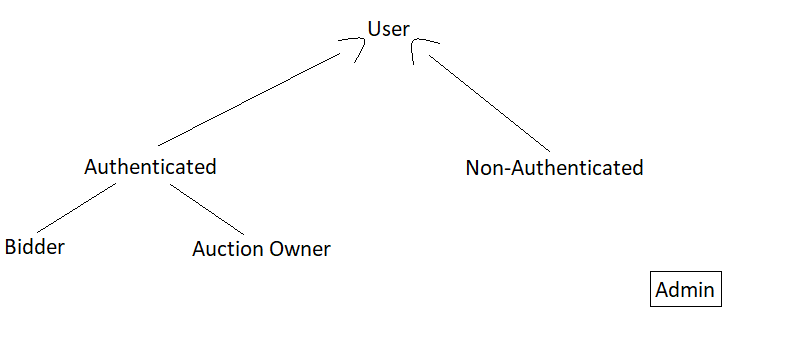

# ER: Requirements Specification Component

> Project vision.

## A1: Project Name

> Goals, business context and environment.  
> Motivation.  
> Main features.  
> User profiles.

---

## A2: Actors and User stories

> This artifact contains the specification of the actors involved and their user stories. This serves as agile documentation of the projects requirements.

### 1. Actors

> For the Online Auctions system, the actors are represented in Figure 1 and described in Table 1.

 Figure 1: Online Auction Actors. 

| Identifier        | Description |
|      :---:        |    :---:    |
| User              | Generic user that has access to public information, such as available auctions.|
| Non-authenticated | Unauthenticated user that can register itself or sign-in the system to participate in bidding or creating an auction.|
|   Authenticated   | Authenticated user that can search available auctions and manage his list of interests.|
|      Bidder       | Authenticated user able to bid in one or more auctions.|
|   Auction owner   | Authenticated user who is able to create an auction of his own.|

 Table 1: Online Auction actors description 

### 2. User Stories

> User stories organized by actor.  
> For each actor, a table containing a line for each user story, and for each user story: an identifier, a name, a priority, and a description (following the recommended pattern).

#### 2.1. Actor 1

#### 2.2. Actor 2

#### 2.N. Authenticated user

| Identifier |               Name              | Priority | Description |
|   :---:    |              :---:              |   :---:  |:---    |
|   FR.201   |      Create Auction      |   high   | As an authenticated user, i want to auction a new item|
|   FR.202   |     Follow Auction  |  medium  | As an authenticated, user i want to have a quicker access and receive notifications from an auction
|   FR.203   |     Report Auction  |  low  | As an authenticated user, i want to signal inappropriate content in an auction, so that administrators can review and deal with the problem as they see fit
|   FR.204   | View Followed Auctions |   medium   | As an authenticated user, i want to access my followed auctions
|   FR.205   |          View My Bidding History         |   medium   | As an authenticated user, i want to see all
|   FR.206   |          View My Auctions         |   high   | As an authenticated user, i want to access the auctions that I own
|   FR.207   |          Add Credit to Account        |   medium   |As an authenticated user
|   FR.208   |          Bid on Auction        |   high   | As an authenticated user

 Table 3: Authenticated user stories 

### 3. Supplementary Requirements

> Section including business rules, technical requirements, and restrictions.  
> For each subsection, a table containing identifiers, names, and descriptions for each requirement.

#### 3.1. Business rules

#### 3.2. Technical requirements

#### 3.3. Restrictions

---

## A3: Information Architecture

> Brief presentation of the artefact goals.

### 1. Sitemap

> Sitemap presenting the overall structure of the web application.  
> Each page must be identified in the sitemap.  
> Multiple instances of the same page (e.g. student profile in SIGARRA) are presented as page stacks.

### 2. Wireframes

> Wireframes for, at least, two main pages of the web application.
> Do not include trivial use cases.

#### UIxx: Page Name

#### UIxx: Page Name

---

## Revision history

Changes made to the first submission:
1. Item 1
1. ...

***
GROUP21gg, DD/MM/2021

* Group member 1 name, email (Editor)
* Group member 2 name, email
* ...