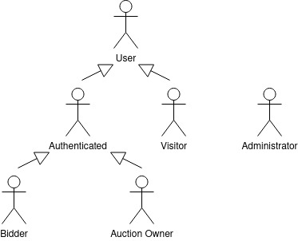

# ER: Requirements Specification Component

> Project vision.

## A1: Hand Of Midas

> Goals, business context and environment.  
> Motivation.  
> Main features.  
> User profiles.

The main goal of the Hand of Midas project is to provide a web based service, where its users are able to buy and/or sell a variety of items of rare characteristics, through online auctions, namely art pieces, decór items, books and jewelry. As the name states, this website encourages the community to increase the added value of such items. The market of rare artifacts is not usually easy to enter, you must know how each community works and lose a lot of time searching for the right item or the right seller, and sometimes the auctions can be private or invitation-only. Hand of Midas seeks to create a more democratic process for interested parties, allowing them to bid on and sell in online auctions for exclusive artifacts in an easy, simple way. 

This website can be used by collectors, enthusiasts and sellers to find and sell unique items. The users need to be authenticated in order to bid on an existing auction, put up an item for sale and manage its auction or even follow auctions they are interested in. An Authenticated User has access to a private dashboard, where they are able to see their bidding and selling history. There’s also an Administrator user group with broader permissions so they can manage all auctions and reports but also edit the categories in which the items are divided in. However, any Non-Authenticated User is able to see the active auctions, view other user profiles and search products by category, starting price, auction ending time and others.

The website will have a responsive design, which allows users to access it from a different range of devices such as smartphones, computers and tablets. Its main goal is to provide an easy and enjoyable experience for both bidders or sellers, and especially regarding browsing auctions and products. 

---

## A2: Actors and User stories

> This artifact contains the specification of the actors involved and their user stories. This serves as agile documentation of the projects requirements.

### 1. Actors

> For the Online Auctions system, the actors are represented in Figure 1 and described in Table 1.

Figure 1: Hand Of Midas Actors.

| Identifier        | Description |
|      :---        |    :---    |
| User              | Generic user that has access to public information, such as available auctions.|
| Non-authenticated | Unauthenticated user that can register itself (sign-up) or sign-in in the system to participate in bidding or to create auctions.|
|   Authenticated   | Authenticated user that can search available auctions and manage their list of interests.|
|      Bidder       | Authenticated user that is able to bid in auctions.|
|   Auction owner   | Authenticated user that is able to create auctions of their own.|

Table 1: Hand Of Midas actors description.

### 2. User Stories

> For the Online Auction system, please refer to the user stories presented below:

#### 2.1. User
| Identifier |               Name              | Priority | Description |
|   :---     |              :---               |   :---   |    :---     |
|   US01     |       View active auctions      |   high   | As a User, I must be able to view all active auctions, so that I'm able to find the ones that interest me. |
|   US02     |   Browse auctions by category   |   high   | As a User, I must be able to search auctions by their specific categories. |
|   US03     |         Search auctions         |   high   | As a User, I must be able to search an active auction at any given time. |
|   US04     |   See Home                      |   high   | As a User, I want to access the home page, so that I can see a brief presentation of the website. |
|   US05     |   See About                     |   high   | As a User, I want to access the about page, so that I can see a complete description of the website and its creators. |
|   US06     |   Consult Services              |   high   | As a User, I want to access the services information, so that I can see the website's services.|
|   US07     |   Consult FAQ                   |   high   | As a User, I want to access the FAQ, so that I can get quick answers to common questions.|
|   US08     |   Consult Contacts              |   high   | As a User, I want to access contacts, so that I can come in touch with the platform creators.|
|   US09     |        View user profiles       |  medium  | As a User, I want to be able to see other user's profiles. |

Table 2: User user stories.

#### 2.2. Visitor
| Identifier |       Name       | Priority | Description |
|   :---     |       :---       |   :---   |    :---     |
|   US11     |   Login/Logout   |   high   | As a Visitor, I want to login into the system, so that I may access information.|
|   US12     |   Registration   |   high   | As a Visitor, I want to be able to register into the system, so that I may access information.|
|   US13     | Recover password |   high   | As a Visitor, I want to be able to recover my password by the registered email, so that I don't lose my account permanently.|

Table 3: Non-authenticated user stories.

#### 2.3. Administrator
| Identifier |               Name              | Priority | Description |
|   :---     |              :---               |   :---   |    :---     |
|   US21     |      Administrator accounts     |   high   | There must be accounts with special privileges in the system. |
|   US22     |     Administer user accounts    |   high   | As an Admin, I must to be able to search, view, edit and create user accounts.|
|   US23     | Block and unblock user accounts |   high   | As an Admin, I must have the ability to block and unblock accounts, so that I can manage the type of users on the website.|
|   US24     |          Manage auction         |   high   | As an Admin, I must be able to view, edit and supervise any auction occurring at any time, so that I can make sure things run smoothly.|
|   US25     |          Cancel auction         |   high   | As an Admin, I must be able to cancel any auction, so that I can manage the type of auctions occurring on the website.|
|   US26     |       Delete user account       |   low    | As an Admin, I want to be able to delete accounts at will, so that I can remove unwanted users from the website.|

Table 4: Administrator user stories. 

#### 2.4. Authenticated user

| Identifier |               Name              | Priority | Description |
|   :---     |              :---               |   :---   |:---    |
|   US31     |      Create Auction             |   high   | As an authenticated user, I want to auction a new item, so that other users can bid on it and eventually buy it. |
|   US32     |          View My Auctions       |   high   | As an authenticated user, I want to access the auctions I own, and all the information attacthed to them
|   US33     |          Bid on Auction         |   high   | As an authenticated user, I want to  bid on an item, by choosing the amount of money to be placed
|   US34     |     Follow Auction              |  medium  | As an authenticated user, I want to follow an auction, so that I have a quicker access to the auctions I'm most interested in.|
|   US35     | View Followed Auctions          |  medium  | As an authenticated user, I want to access my followed auctions, so that I can unfollowed them, or visit them more easily.|
|   US36     |     View My Bidding History     |  medium  | As an authenticated user, I want to see all the bids I made, so that I can see their value and to what auction they refer to.|
|   US37     |          Add Credit to Account  |  medium  | As an authenticated user, I want to be able to transfer money into my account wallet, so that I can place bids on auctions
|   US38     |     Report Auction              |    low   | As an authenticated user, I want to signal inappropriate content in an auction, so that administrators can review and deal with the problem as they see fit.|

Table 5: Authenticated user stories.

#### 2.5. Bidder
| Identifier |               Name             | Priority | Description |
|   :---     |              :---              |   :---   |:---    |
|   US41     |  View Auction Bidding History  |  high    | As a bidder, I want to access all the bids placed on an auction, so that I can keep track of everyone who has placed bids (add more TODO)|
|   US42     |      Rate Seller               |   medium | As a bidder, I want to classify a seller, by leaving a 1 to 5 rating and/or a comment on their profile, so that other users have a better idea of that seller's reliability.|

Table 5: Bidder user stories.

#### 2.6. Auction Owner
| Identifier |               Name              | Priority | Description |
|   :---     |              :---               |   :---   |:---    |
|   US51     |     Edit Auction                |   high   | As an auction owner, I want to change the information of one of my auctions, so that it's up-to-date.|
|   US52     |     Cancel Auction              |   high   | As an auction owner, I want to completly remove an auction from the platform, so no one is able to see it.|
|   US53     |     Manage Auction Status       |  medium  | (Not Sure)

Table 5: Auction owner user stories.

### 3. Supplementary Requirements

#### 3.1. Business rules

| Identifier | Name                         | Description   |
| :---       | :---                         | :---          |
| BR01       | Private Data Storage         | Upon account deletion (FR.014) shared user data is kept but is made anonymous |
| BR02       | Independent Accounts         | Administrator accounts are independent of the user accounts, i.e. they cannot create or participate in auctions. |
| BR03       | Auction Cancellation         | An auction can only be canceled if there are no bids. |
| BR04       | Valid Bidding                | A user cannot bid if his bid is the current highest. |
| BR05       | Auction (Deadline) Extension | When a bid is made in the last 15 minutes of the auction, the auction deadline is extended by 30 minutes. |

Table 6: Hand Of Midas business rules.

#### 3.2. Technical requirements

| Identifier | Name          | Description   |
| :---       | :---          | :---          |
| TR01       | Availability  | The system must be available at all times. |
| TR02       | Accessibility | The system must ensure that everyone can access the pages, regardless of whether they have any handicap or not, or the Web browser they use. |
| TR03       | Usability     | The system should be simple and easy to use. The Hand Of Midas system is designed to be used by collectors and enthusiasts with or without technical experience, so good usability is an important requirement.  |
| TR04       | Performance   | The system should have response times shorter than 2s to ensure the user's attention. |
| TR05       | Web application    | The system should be implemented as a web application with dynamic pages (HTML5, JavaScript, CSS3 and PHP). It is critical that the Hand Of Midas system is easily accessible from anywhere without the need to install specific applications or software, adopting standard web technologies. |
| TR06       | Security      | The system shall protect information from unauthorized access through the use of an authentication and verification system. |
| TR07       | Robustness    | The system must be prepared to handle and continue operating when runtime errors occur. |
| TR08       | Scalability   | The system must be prepared to deal with the growth in the number of users and their actions. |
| TR09       | Ethics   | The system must respect the ethical principles in software development (for example, personal user details, or usage data, should not be collected nor shared without full acknowledgement and authorization from its owner). |

Table 7: Hand Of Midas technical requirements.

#### 3.3. Restrictions

A restriction on the design limits the degree of freedom in the search for a solution

| Identifier | Name          | Description   |
| :---       | :---          | :---          |
| C01        | ??????????? TODO   |               |

Table 8: Hand Of Midas project restrictions.

---

## A3: Information Architecture

> Brief presentation of the artefact goals.

### 1. Sitemap

> Sitemap presenting the overall structure of the web application.  
> Each page must be identified in the sitemap.  
> Multiple instances of the same page (e.g. student profile in SIGARRA) are presented as page stacks.

### 2. Wireframes

> Wireframes for, at least, two main pages of the web application.
> Do not include trivial use cases.

#### UIxx: Page Name

#### UIxx: Page Name

---

## Revision history

Changes made to the first submission:
1. Item 1
1. ...

***
GROUP21gg, DD/MM/2021

* Group member 1 name, email (Editor)
* Group member 2 name, email
* ...
