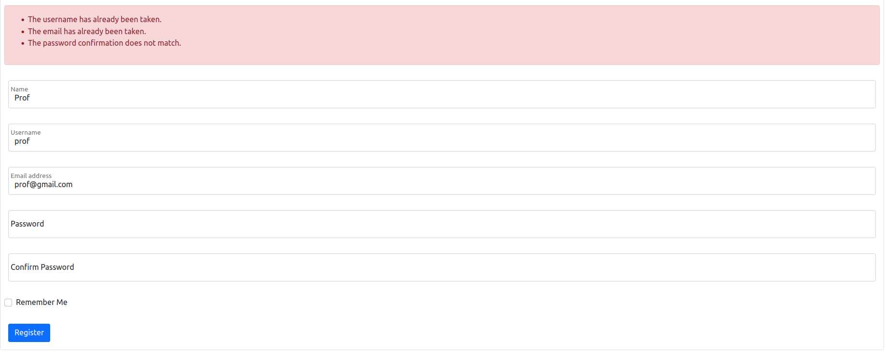
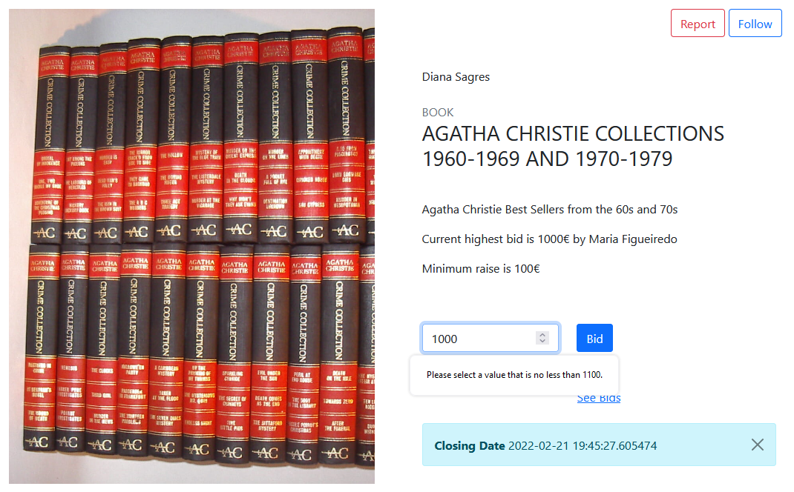
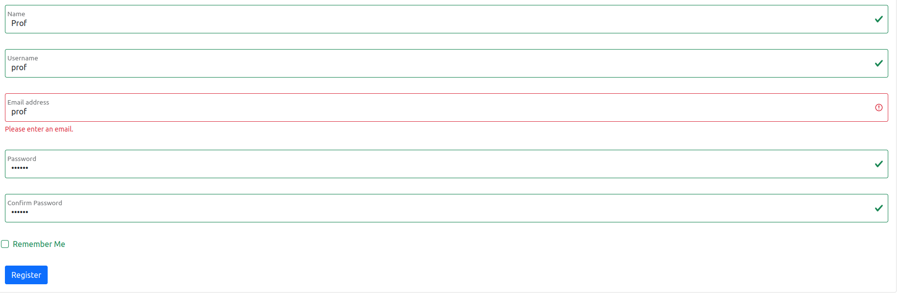

# PA: Product and Presentation

This project consists in an auction website for antiques, that being works of art, books, furniture, jewelry and more.

## A9: Product

The majority of auctions, taken in person, causes a huge number of inconviniences, such as the weight of the objects to carry or its carefull manouvre, such as to not accidentally make it loose its value. As such, just being present carries a number of extra costs that could be absolutely avoidable or mitigated

That is the focus behind our product. Our platform presents an easy and conveninet way of bidding or auctioning off valuable articles, in absolute confort.

Our platforms design is rather intuitive, whereby the average user will see no problem utilising it, making their experience that much more enjoyable.

### 1. Installation

Link to the source code's final version: https://git.fe.up.pt/lbaw/lbaw2122/lbaw2123  
> Full Docker command to test the group's Docker Hub image using the DBM database.  

### 2. Usage

URL to the product: http://lbaw2123.lbaw.fe.up.pt  

#### 2.1. Administration Credentials 

| Username | Password |
| -------- | -------- |
| admin@gmail.com    | JdNtVVVe |

#### 2.2. User Credentials

| Type          | Username  | Password |
| ------------- | --------- | -------- |
| bidder/auction owner |  prof@gmail.com    | JdNtVVVe |

\pagebreak
### 3. Application Help

Help and error messages are displayed upon form submission in various areas of the website. These messages clarify to the user what was wrong or missing with their input.

Some examples of this are the Login form, the Registration Form and Auction Creation

{ height=150px }

Image 1. Example of a message from register error.

### 4. Input Validation

Input data is always validated both client-side and server-side. This acts as double safety for user input.
Some examples of where this validation occurs are login, register, auction creation, bid on action.
Client side validation usually checks for required fields and correct data types (number, text, file extension, etc) while server side validation checks those same conditions and also checks for contextual validity.

Here are some examples of Client-Side validation messages:

{ height=150px } 

Image 2. Example of a bid that is too low.

{ height=150px } 

Image 3. Example of invalid email

And here's an example of Server-Side validation messages:

{ height=150px } 

Image 4. Example of invalid register

### 5. Check Accessibility and Usability

Accessibility: https://ux.sapo.pt/checklists/acessibilidade/  TODO
Usability: https://ux.sapo.pt/checklists/usabilidade/  TODO

### 6. HTML & CSS Validation

> Provide the results of the validation of the HTML and CSS code using the following tools. Include the results as PDF files in the group's repository. Add individual links to those files here.
>   
> HTML: https://validator.w3.org/nu/  
> CSS: https://jigsaw.w3.org/css-validator/  

### 7. Revisions to the Project

Some of the routes from the openAPI (A7) were changed. 

Our initial sql schema was changed as we developed the project. Some things that were changed are:

    - Notification tables
    - Some triggers
    - Added attribute 'is_admin' to User table to check if a certain user is an Admin

### 8. Implementation Details

#### 8.1. Libraries Used

> Include reference to all the libraries and frameworks used in the product.  
> Include library name and reference, description of the use, and link to the example where it's used in the product.  

\pagebreak

#### 8.2 User Stories

| US Identifier | Name    | Module | Priority                       | Team Members               | State  |
| --             | ---------                   | ---      | --             | -------- | --- |
|  US01          | View active auctions        | Module 2 | High           | **Maria Figueiredo**, Rita Ramada  |   100%  | 
|  US02          | Browse auctions by category | Module 2 | High           | **Rita Ramada**  |   100%  | 
|  US03          | Search Auctions             | Module 2 | High           | **Rita Ramada**  |   50%  | 
|  US04          | See Home                    | Module 5 | High           |                  |   0%  | 
|  US05          | See About                   | Module 5 | High           | **Deborah Lago**, Afonso Monteiro  |   100%  | 
|  US06          | Consult Services            | Module 5 | High           | **Deborah Lago**, Afonso Monteiro  |   100%  | 
|  US07          | Consult FAQ                 | Module 5 | High           | **Deborah Lago**, Afonso Monteiro  |   100%  | 
|  US08          | Consult Contacts            | Module 5 | High           | **Deborah Lago**, Afonso Monteiro  |   100%  | 
|  US09          | View/Search user profiles   | Module 3 | Medium         | **Rita Ramada**  |   75%  | 
|  US11          | Login                       | Module 1 | High           | **Maria Figueiredo**  |   100%  | 
|  US12          | Register                    | Module 1 | High           | **Maria Figueiredo**, Rita Ramada  |   100%  | 
|  US13          | Recover password            | Module 1 | High           |   |   0%  | 
|  US21          | Administer user accounts    | Module 4 | High           | **Maria Figueiredo**, Afonso Monteiro |   100%  | 
|  US22          | Block and unblock user accounts | Module 4 | High       |  |   0%  | 
|  US23          | Manage Auction              | Module 4 | High           | **Maria Figueiredo** |   50%  | 
|  US24          | Cancel Auction              | Module 4 | High           | **Maria Figueiredo** |   100%  | 
|  US25          | Delete user account         | Module 4 | High           | **Maria Figueiredo**  |   100%  | 
|  US26          | Notifications               | Module 4 | Medium         | **Maria Figueiredo**  |   100%  | 
|  US31          | View/Edit Profile           | Module 3 | High           | **Rita Ramada**, Maria Figueiredo  |   100%  | 
|  US32          | Create Auction              | Module 2 | High           | **Maria Figueiredo**, Rita Ramada  |   100%  | 
|  US33          | Edit/Delete Auction         | Module 2 | High           | **Maria Figueiredo**, Rita Ramada  |   100%  | 
|  US34          | Edit/Delete Comment         | Module 2 | High           |   |   0%  | 
|  US35          | View My Auctions            | Module 2 | High           | **Maria Figueiredo**, Rita Ramada  |   100%  | 
|  US36          | Bid on Auction              | Module 2 | High           | **Maria Figueiredo**  |   100%  | 
|  US37          | Logout                      | Module 1 | High           | **Maria Figueiredo**  |   100%  | 
|  US38          | Follow Auction              | Module 1 | Medium         | **Deborah Lago**, Maria Figueiredo  |   100%  | 
|  US39          | View Followed Auctions      | Module 1 | Medium         |   |   0%  | 
|  US310         | View My Bidding History     | Module 3 | Medium           | **Maria Figueiredo**, Rita Ramada |   100%  | 
|  US311         | Add Credit to Account       | Module 3 | Medium           |   |   0%  | 
|  US310         | Report Auction              | Module 2 | Low           | **Afonso Monteiro**, Maria Figueiredo  |   80%  | 
|  US41          | View Auction Bidding History| Module 2 | High           | **Maria Figueiredo**, Rita Ramada  |   100%  | 
|  US42          | Rate Seller                 | Module 3 | Medium         | **Rita Ramada**, Maria Figueiredo  |   100%  | 
|  US51          | Edit Auction                | Module 2 | High           | **Maria Figueiredo**, Rita Ramada  |   100%  | 
|  US52          | Cancel Auction              | Module 2 | High           | **Maria Figueiredo**  |   100%  | 
|  US53          | Manage Auction Status       | Module 2 | Medium         | **Maria Figueiredo**  |   100%  | 

---

## A10: Presentation
 
> This artefact corresponds to the presentation of the product.

### 1. Product presentation

> Brief presentation of the product and its main features (2 paragraphs max).  
>
> URL to the product: http://lbaw21gg.lbaw.fe.up.pt  
>
> Slides used during the presentation should be added, as a PDF file, to the group's repository and linked to here.

### 2. Video presentation

> Screenshot of the video plus the link to the lbaw21gg.mp4 file  

> - Upload the lbaw21gg.mp4 file to the video uploads' [Google folder](https://drive.google.com/drive/folders/1HDNOZ4y834m7pXgJ0XjNa_ZC26e9-Xge?usp=sharing "Videos folder"). You need to use a Google U.Porto account to upload the video.   
> - The video must not exceed 2 minutes.
> - Include a link to the video on the Google Drive folder.

---

## Revision history

Changes made to the first submission:
1. Item 1
1. ..

***
GROUP21gg, DD/MM/2021

* Group member 1 name, email (Editor)
* Group member 2 name, email
* ...